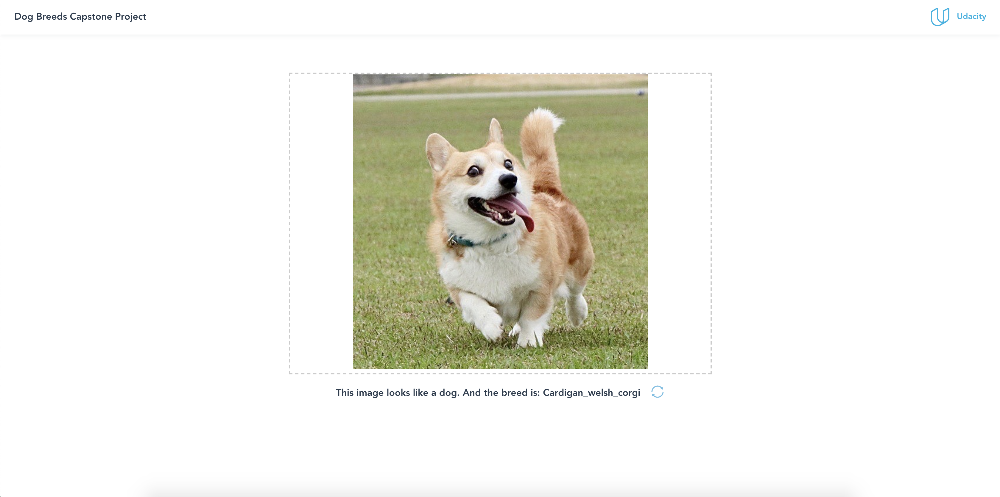

# Convolutional Neural Networks Dog breed Recognition Project

## Description
This repo is part of Data Science Nanodegree Capstone Program with user-supplied images of dogs and humans. I built a CNN(Convolutional Neural Networks) pipeline to categorize images. If the image contains a dog, the algorithm will make an estimate of its breed and if supplied an image of a human, the code will identify the resembling dog breed. If there is no dog nor human, the code tells user there is no dogs or humans. The model may provide a simple example of image content recognition and identification. Provided with different training data, the model may be used to identificate other items, such as other animals, plants and so on.

Besides the cutting-edge CNN models for classification, I also built the Flask backend using the saved CNN model as well as a front-end web for users to upload the image.

This project consists of three sections:

1. Build a ML pipeline to train the CNN model to classify dog breeds and export the saved data.
2. Build backend APIs with flask to support the web app.
3. Run a web app which that users can upload images and see the results. 

## Getting Started

### Dependencies
* Python 3.8+
* Machine Learning Libraries: NumPy, SciPy, Pandas, Sciki-Learn
* Model Loading and Saving Library: Pickle
* Web Backend API: Flask
* NodeJs 14.0+

### Executing Program:
1. Download the [dog dataset](https://s3-us-west-1.amazonaws.com/udacity-aind/dog-project/dogImages.zip).  Unzip the file and place it in the repo at: `./data/dog_images`. 

2. Download the [human dataset](https://s3-us-west-1.amazonaws.com/udacity-aind/dog-project/lfw.zip).  Unzip the file and place it in the repo at: `./data/lfw`. 
    
3. Download the [DogVGG16Data.npz](https://s3-us-west-1.amazonaws.com/udacity-aind/dog-project/DogVGG16Data.npz). Uzip the file and place it in the repo at `./bottleneck_features`.
      
4. Download the [DogResnet50Data.npz](https://s3-us-west-1.amazonaws.com/udacity-aind/dog-project/DogResnet50Data.npz). Uzip the file and place it in the repo at `./bottleneck_features`.

5. Unzip `./saved_models/weights.best.from_scratch.hdf5.gz` file.

6. Create (and activate) a new environment.
	```
	conda env create -f requirements/requirements.txt -n udacity-dog-project
	source activate udacity-dog-project
	```  

5. To start the backend API with the model trained with Resnet50 bottleneck features, run the following command:
    `python app/run.py`

6. Start another terminal, go to `app` folder and run `npm i` or `yarn` to install necessary packages of the front-end package, then run `npm serve` after installation.

7. Go to http://localhost:8080/

### Files for the web app
**app/web/***: front-end web app project

**app/run.py**: Script to launch the Flask web back-end API

**app/api-doc.yaml**: Document of the back-end API in yaml

### Jupyter Files

The jupyter notebook in the **dog_app.ipynb** file can help you understand how the model is trained.
Please refer to the jupter notebook for data exploration, model training, model evalution and conclusion.

## Acknowledgements
* [Udacity](https://www.udacity.com/) for providing the data scientist program
* [Resnet paper](https://arxiv.org/abs/1512.03385)
* [Weight initialization](https://pytorch.org/docs/stable/nn.init.html)
* [CSS Styling](https://heartbeat.fritz.ai/brilliant-beginners-guide-to-model-deployment-133e158f6717)

## Screenshots

1. This is the home page to the app:


2. After upload image and clicking **Submit** button, we can see the result as a text:

